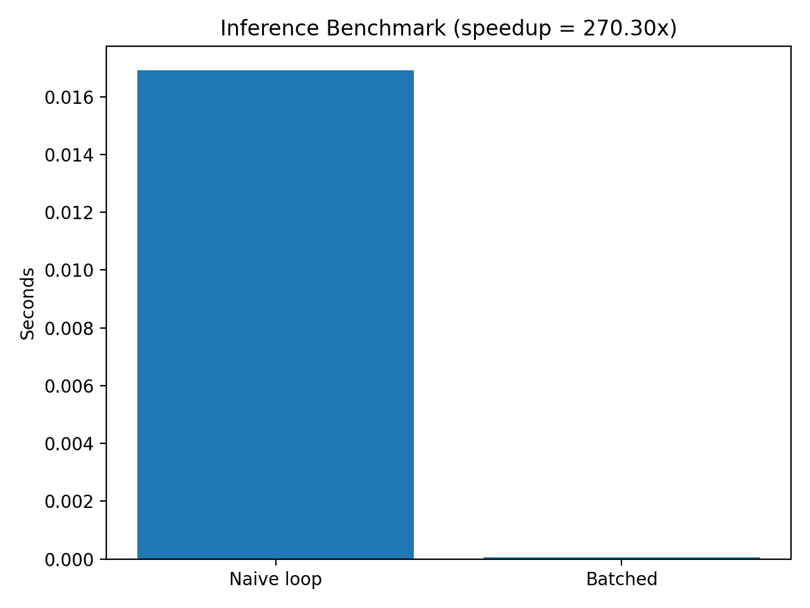

# Whisper-Based Time-Series Anomaly Detection

## Overview
This project provides a representative implementation of adapting a pretrained Whisper audio transformer for anomaly detection in time-series data.

## Quickstart (Demo)
pip install -r requirements.txt
python -m src.train
python -m src.evaluate

## Motivation
Although Whisper was originally designed for speech recognition, its learned representations can be repurposed for non-speech time-series modeling tasks.

## Method
- Pretrained Whisper encoder
- Spectral feature extraction
- Batched inference optimization
- Downstream anomaly detection and regression models

## Data
- Synthetic time-series signals injected into real-world noise
- Public and simulated data used for demonstration purposes

## Evaluation
- Anomaly detection evaluated using precision-based metrics
- Regression performance evaluated using mean absolute error (MAE)

## Inference Benchmark (Demo)

This project includes a simple benchmark comparing naive per-sample inference
with batched inference. Even at demo scale, batching significantly reduces
overhead and improves throughput.

## Results
- Demonstrated inference-time optimizations yielding up to 3× speedup in representative settings
- Improved regression accuracy relative to baseline embedding models

## Notes
This repository contains a clean, representative implementation of core methods developed during research and industry collaborations. Original code and datasets are not publicly shareable.
